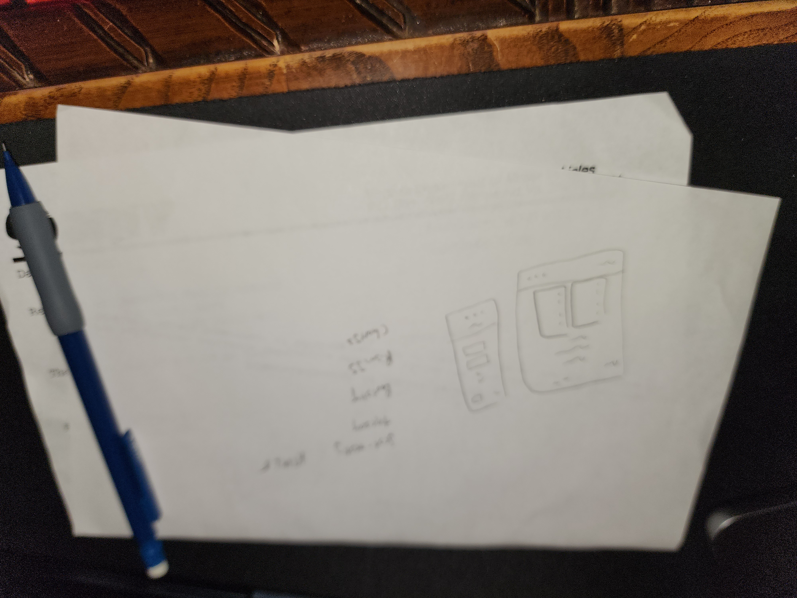

# Promineo Week  Homework

This is my homework for week  of the Promineo Front End Development Bootcamp. 

## Table of contents

- [Overview](#overview)
  - [Links](#links)
- [My process](#my-process)
  - [What I learned](#what-i-learned)
- [Author](#author)


## Overview

Coding Steps:
	•	Create a new website using HTML and Bootstrap. The website must include the following:
	•	At least 2 pages.
	•	A Bootstrap navbar, table, and form.
	•	Bootstrap grid used throughout to format elements
	•	Elements should stack vertically when the window is small

### Links
- Live Site URL: [Live Site On GitHub Pages]()

## My process
First I started with a picture of what I wanted the page structure to look like. Here's a picture of that: 



Then I layed out the basic HTML. Honestly this project was pretty easy again so I decided to add some fancy JS plugins as well as a special challenge for myself. 

So behold I have created a mortgage tracker that also uses a line graph to map out data for you over time! 

Oh also, you know I couldn't stop there! I have a serious problem. I added Jest for testing AND added typescript for type safety. 

Ya boi doesn't know how to take it easy y'all! 

### What I learned
I learned how to use both PrismJS and ChartJS in this project! Here's how I implemented those! 


```css 

```


```js
```


## Author

- Twitter - [@barnett_travis5](https://twitter.com/barnett_travis5)
- LinkedIn - [@travis-barnette-ba7987237](https://www.linkedin.com/in/travis-barnette-ba7987237/)